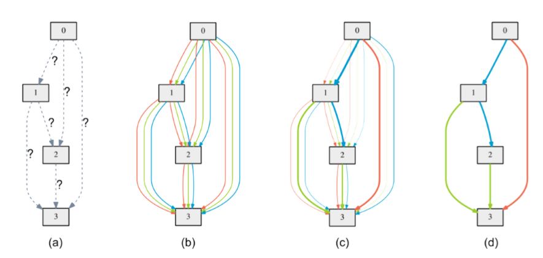
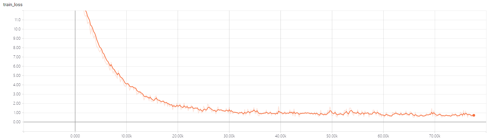
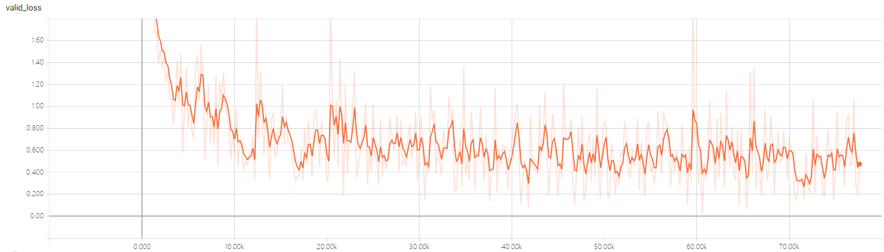
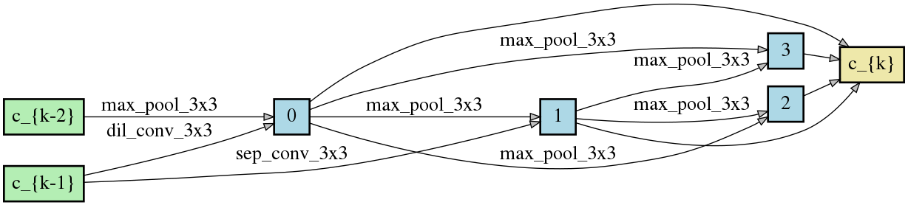
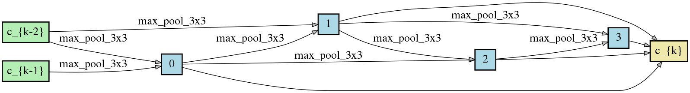
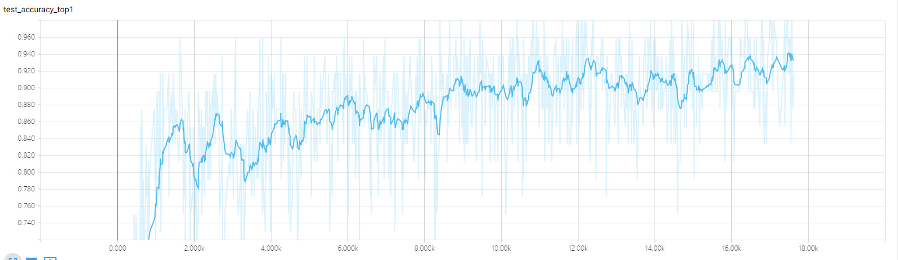

## Paper 
This code implement the DARTS paper in Tensorflow
>[DARTS: Differentiable Architecture Search](https://arxiv.org/abs/1806.09055)  
>Hanxiao Liu, Karen Simonyan, Yiming Yang.  
>arXiv:1806.09055.  
<p align="center">
  
</p>  

## Architecture Search 
To carry out architecture search using 2nd-order approximation, run
```
python cnn/train_search.py
```
NOTE:
* Only implement the Cifar10 experiments
* Bacht size is set to only 16 (64 in the pytorch Ver) for the OOM issue using one single 1080 Ti GPU
* Only implement the 2nd-order approximation, but you can simply modify the code if you want 1st-order one
* Didn't implement the PATH DROP operation on test code for the unclear motivation  

Here shows the details training pocess
<p align="center">
  
  
</p>  
<p align="center">
Fig. The Train loss and Valid loss of the searching process
</p>  

The train loss is decreased steadly during the searching pocess, which is more stable than the RL based method. Note that the valid loss refer to the 2nd-order loss for architecture params.  
<p align="center">
  
  </p> 
  <p align="center">
  Fig. The final normal cell  
  </p>  
  <p align="center">
    
  <p align="center">  
  Fig. The final reduction cell  
  </p>  
</p>  

## Architecture evaluation  
The test error finally decreased to around 5.8 after training 415 epoches, while the best results in pytorch version is 2.76 but trained with 600 epoches. Training more epoches can narrow the gap of performance drop. Besides that, repeating the architecture search process with different seed to choose the best structure can avoid local minimun. 
<p align="center">
  
</p> 
<p align="center">
  Fig. The test accuracy of the searched architecture  
</p> 

## Acknowledgement
* This implementation is based on the original Torch implementation [quark0/darts](https://github.com/quark0/darts)  
